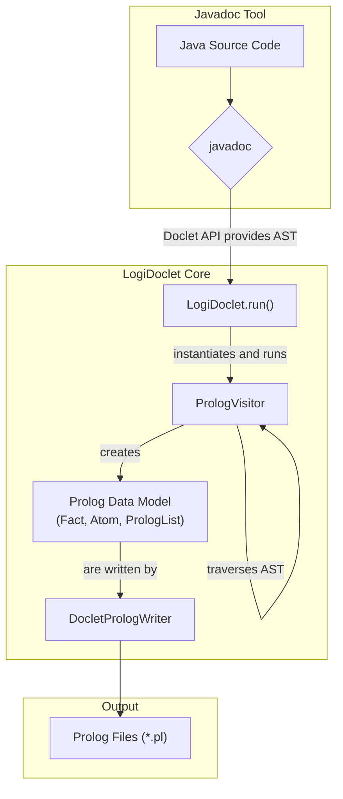

# LogiDoclet


[](https://www.oracle.com/java/technologies/javase/jdk17-archive-downloads.html)
[](https://github.com/grimch/logidoclet/releases)
[](https://github.com/grimch/logidoclet/stargazers)
[](https://github.com/grimch/logidoclet/network)
[](https://github.com/grimch/logidoclet/commits/main)
[](https://github.com/grimch/logidoclet)
[](https://opensource.org/licenses/MIT)

LogiDoclet is a Javadoc Doclet that generates a LLM-friendly representation of your Java codebase. It is designed to make software projects more accessible for analysis by AI agents and large language models.

## Motivation for LogiDoclet
In long-standing, in-house software projects, developer turnover is a significant challenge. New team members face a steep learning curve, trying to understand a large, complex codebase with incomplete or outdated documentation.

This "knowledge gap" slows down development and hinders maintenance. Using AI to understand the code directly is often cost-prohibitive due to high token costs and context window limitations.

LogiDoclet addresses these challenges by acting as a **semantic indexer**, which provides a compact, structured, and unambiguous set of facts representing the codebase.

___

## User Guide

There are two primary ways to use LogiDoclet: directly via the `javadoc` command-line tool, or as a plugin in a Maven build.

### 1. Direct javadoc Execution

To use LogiDoclet, you invoke the standard `javadoc` tool and specify `LogiDoclet` as the doclet. This method is useful for quick analysis or for use in non-Maven projects.

#### Options
*   `-d <directory>`: **(Required)** Specifies the output directory. **It is highly recommended to use a directory outside of `target/`** (e.g., `build/prolog-docs`) to prevent generated files from being deleted by `mvn clean`.
*   `-docletpath <path_to_jar>`: **(Required)** Specifies the path to the LogiDoclet JAR file. You must build the project first (`mvn clean install`) to create this JAR in the `target/` directory.
*   `-outputCommentary`: (Optional) Includes Javadoc comments in the Prolog output. If omitted, a "minimal" version without comments is generated.
*   All other standard `javadoc` options like `--source-path` and `-subpackages` are supported.

#### Example Commands

**Generating docs for a project:**
```bash
# First, build LogiDoclet to create the JAR
# mvn clean install

# Then, run javadoc on your own project
javadoc -doclet io.github.grimch.doclet.LogiDoclet \
        -docletpath 'path/to/logidoclet/target/logidoclet-1.0.0.jar' \
        -d build/prolog-docs \
        --source-path path/to/your/project/src/main/java \
        -subpackages com.your.project.packages
```

**Generating docs for the included sample:**
This command generates Prolog facts for the sample code included in this repository's test resources.
```bash
# Assumes you have built the project with 'mvn clean install'
javadoc -doclet io.github.grimch.doclet.LogiDoclet \
        -docletpath 'target/logidoclet-1.0.0.jar' \
        -d build/prolog-sample-docs \
        --source-path src/test/resources/sample_module \
        -subpackages io.github.grimch.doclet.sample_module
```

### 2. Usage with Maven

You can also integrate LogiDoclet directly into your project's `pom.xml` using the `maven-javadoc-plugin`.

#### Setup
1.  **Install LogiDoclet Locally:** Since it is not yet available on Maven Central. You must build and install it locally first:
    ```bash
    # In the logidoclet project directory
    mvn clean install
    ```
2.  **Configure Your `pom.xml`:** Add the `maven-javadoc-plugin` to your project's `pom.xml` and configure it to use LogiDoclet.

An example `pom.xml` is provided in the [`examples/maven-usage/`](./examples/maven-usage/) directory. You can adapt the `<plugin>` section from this file into your own project.

Key configuration snippet from the example which shows how generate standard javadoc and LogiDoc output in parallel:

```xml
<plugin>
    <groupId>org.apache.maven.plugins</groupId>
    <artifactId>maven-javadoc-plugin</artifactId>
    <version>${maven.javadoc.plugin.version}</version>
    <configuration>
        <!-- uncomment next two lines for troubleshooting -->
        <debug>true</debug>
        <verbose>true</verbose>
    </configuration>

    <executions>
        <execution>
            <id>default-javadoc</id>
            <phase>compile</phase>
            <goals>
                <goal>javadoc</goal>
            </goals>
            <configuration>
                <classifier>default-javadoc</classifier>
                <outputDirectory>${project.build.directory}/javadoc</outputDirectory>
                <show>private</show>
            </configuration>
        </execution>

        <execution>
            <id>logidoclet-javadoc</id>
            <phase>compile</phase>
            <goals>
                <goal>javadoc</goal>
            </goals>
            <configuration>
                <classifier>logidoclet-javadoc</classifier>
                <!-- uncomment next two lines for troubleshooting -->
                <!-- The next is necessary because otherwise LogiDoclet will respective parameter -->
                <disableNoFonts>true</disableNoFonts>
                <doclet>io.github.grimch.doclet.LogiDoclet</doclet>
                <docletArtifact>
                    <groupId>io.github.grimch</groupId>
                    <artifactId>logidoclet</artifactId>
                    <version>${logidoclet.version}</version>
                </docletArtifact>
                <useStandardDocletOptions>false</useStandardDocletOptions>
                <additionalOptions>
                    <!-- Pass the output directory to your custom doclet -->
                    <additionalOption>-d ${logidoc.output.directory}</additionalOption>
                    <!-- Pass the outputCommentary flag -->
                    <!-- Comment out the line below to enable full output -->
                    <additionalOption>-outputCommentary</additionalOption>
                    <!-- Pass the prettyPrint flag -->
                    <!-- Comment out the line below to enable full output -->
                    <!-- Note: tokenization is more efficient wit this disabled -->
                    <additionalOption>-prettyPrint</additionalOption>
                </additionalOptions>
            </configuration>
        </execution>
    </executions>
</plugin>
```
#### Standalone Example Project
To make it easy to experiment, a complete, runnable Maven example is provided in the [`examples/maven-usage/`](./examples/maven-usage/) directory.

**To run the example:**
1.  **Navigate to the example directory:**
    ```bash
    cd examples/maven-usage
    ```
2.  **Run the setup script:** This will copy the sample source from *src/test/resources/sample_module* into the example project.
    *   On Linux or macOS:
        ```bash
        bash setup_example.sh
        ```
    *   On Windows:
        ```cmd
        setup_example.bat
        ```
3.  **Run the Maven javadoc plugin:**
    ```bash
    mvn clean compile
    ```
    **Note that you need to explitly run Maven `compile` phase and not `javadoc:javadoc` goal for maven to run both executions!**

    The Prolog documentation will be generated in the `examples/maven-usage/build/prolog-docs` directory. Output will be full output (inlcuding comments) and formatted.

### Output Files and AI Tool Integration

LogiDoclet generates several files in the specified output directory (`-d` option), which are crucial for AI agent integration:

*   **`java_metastructure.pl`**: This file defines the Prolog schema (predicates and their arities) used to represent the Java codebase. It's essential for any Prolog-based AI agent to correctly interpret the generated facts.
*   **`LLM_context.md`**: This Markdown file provides a high-level overview and context of the Java project, intended to be consumed directly by Large Language Models (LLMs). It summarizes the project's structure and key components, helping the LLM to quickly grasp the codebase's purpose and organization.
*   **`templates/master_LLM_context.md.template`**: This file serves as a structured template for initializing AI tools like Claude Code and Gemini CLI. It is designed to be copied directly into your project's root directory (or a designated context directory for your AI tool) under a suitable name (e.g., `gemini.md` or `claude.md`). The AI tool is then expected to interpret this file, which contains references to `LLM_context.md` and the generated Prolog facts, to establish its initial context about the codebase. The template itself does not require manual placeholder replacement by the user.

### Formatted Prolog Output Example

To illustrate the output of LogiDoclet, you can examine the Java classes used for unit testing and their corresponding expected formatted Prolog representation. The `-prettyPrint` option was used to generate this output.

*   **Sample Java Source Files:** [`src/test/resources/sample_module`](./src/test/resources/sample_module)
*   **Expected Formatted Prolog Output Files:** [`src/test/resources/expected_output/full`](./src/test/resources/expected_output/full)

---
## Developer Guide

This guide provides information for developers who want to contribute to LogiDoclet itself.

### Prerequisites
*   Java Development Kit (JDK) 17 or later.
*   Apache Maven 3.6.0 or later.

### Building and Testing
LogiDoclet is a standard Maven project. To build the project, run the tests, and install it in your local repository, execute:
```bash
mvn clean install
```
This command will also run the integration test in `LogiDocletTest`, which generates Prolog facts for a sample project and compares them against an expected output.

### Core Concepts

#### Architecture Overview
LogiDoclet hooks into the `javadoc` toolchain. The tool parses the Java source and provides an Abstract Syntax Tree (AST) to our doclet, which then transforms the AST nodes into Prolog facts.



#### Project Structure
```
.
├── pom.xml                 # Maven build configuration
└── src
    ├── main
    │   ├── java
    │   │   └── io/github/grimch/doclet
    │   │       ├── LogiDoclet.java         # Main doclet entry point
    │   │       └── prolog
    │   │           ├── PrologVisitor.java       # Traverses the Java AST
    │   │           ├── DocletPrologWriter.java  # Writes facts to files
    │   │           ├── PrettyPrinter.java       # Formats output for better readability (note that this will make tokenizazion less efficient).
    │   │           └── *.java                   # Prolog data model (Term, Fact, etc.)
    │   └── resources
    │       └── java_metastructure.pl            # Defines the Prolog schema for the facts
    │       └── jLLM_context.md                  # Information for the LLM how to use/traverse the javadoc information.
    │       └── master_LLM_context_template.md   # A template for the initial context file at the project root folder (see above).
    └── test
        ├── java                        # Unit and integration tests
        └── resources
            ├── sample_module           # A sample Java project for testing
            └── expected_output         # The expected Prolog output for the sample
```

#### Key Components
1.  **`LogiDoclet`**: The main class implementing `jdk.javadoc.doclet.Doclet`. It handles options and orchestrates the process.
2.  **`PrologVisitor`**: A `SimpleElementVisitor9` that does the core work. It traverses the AST elements (modules, packages, types, methods) provided by the Doclet API.
3.  **Prolog Data Model (`Term`, `Fact`, `Atom`, `PrologList`)**: A set of classes that represent Prolog constructs. The `PrologVisitor` builds a tree of these objects, which can then be serialized into valid Prolog syntax via their `toString()` methods.
4.  **`DocletPrologWriter`**: Manages the creation of the output directory structure and writes the generated Prolog facts into `.pl` files.

---

## License
This project is licensed under the MIT License - see the [LICENSE.md](LICENSE.md) file for details.
