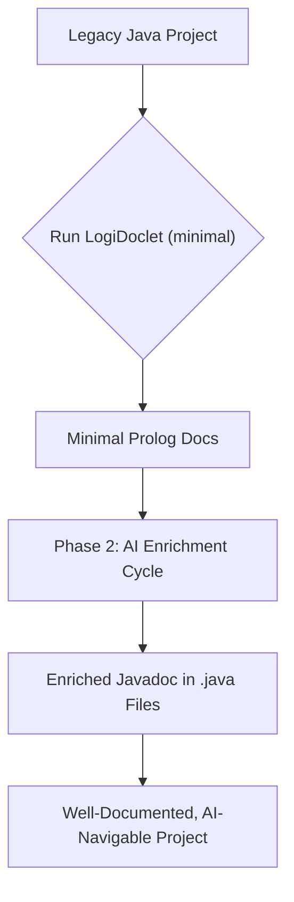
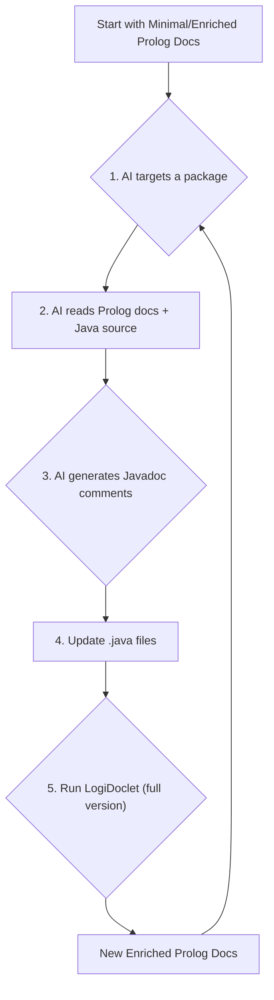

# LogiDoclet

LogiDoclet is a Javadoc Doclet that generates a machine-readable Prolog representation of your Java codebase. It is designed to enable efficient, cost-effective, and deep analysis of software projects by AI agents, bridging the gap between legacy code and modern large language models.

## The Problem: Knowledge Gaps in Complex Codebases

In long-standing, in-house software projects, developer turnover is a significant challenge. When experienced developers leave, they take a vast amount of undocumented knowledge with them. New team members face a steep learning curve, trying to understand a large, complex codebase with incomplete or outdated documentation. This "knowledge gap" slows down development, hinders maintenance, and increases the risk of introducing bugs.

A common idea is to use AI as a "golden hammer"—simply feeding the entire codebase to a large language model and asking it to understand everything. However, as our analysis has shown, this approach is fundamentally flawed and cost-prohibitive for several reasons:

1.  **Extreme Token Cost:** Raw source code, filled with logic, boilerplate, and comments, is incredibly verbose. Processing millions of lines of code translates directly to high operational costs.
2.  **Low Signal-to-Noise Ratio:** For structural understanding, the actual implementation logic inside a method is "noise." An AI must sift through thousands of tokens of code to extract a few key facts, like a method's signature or its relationship to other classes.
3.  **Context Window Limitations:** Even the largest context windows cannot hold an entire enterprise-level codebase, making true holistic analysis impossible in a single pass.
4.  **Inefficiency of HTML Javadoc:** Standard HTML documentation is built for human presentation, not machine analysis. It is bloated with markup and requires complex parsing, making it even less efficient than analyzing raw code.

## The Solution: LogiDoclet - The AI's Jackhammer

LogiDoclet addresses these challenges by acting as a **semantic indexer** for your codebase. Instead of asking an AI to read an entire library, LogiDoclet provides it with a map—a compact, structured, and unambiguous set of facts.

It's the difference between giving an AI a library card catalog versus telling it to read every book on every shelf. LogiDoclet is not a golden hammer; it's a precision tool—a jackhammer that provides the AI with manageable, high-density pieces of information it can easily handle and reason about.

### Key Advantages

*   **Massive Cost Reduction:** Drastically reduces token consumption (by over 90% in tests) for AI analysis compared to raw code or HTML Javadoc.
*   **High-Density Information:** Provides a noise-free, structured view of the codebase's architecture, types, and their relationships.
*   **Enables Large-Scale Analysis:** The compact format allows an entire project's structure to fit within an AI's context window, enabling holistic and deep architectural queries.
*   **Bootstraps Knowledge Transfer:** Facilitates a powerful workflow for documenting legacy code and accelerating the onboarding process for new developers.

## The Two-Phase Approach: Bootstrapping Code Understanding

LogiDoclet is designed to be used in a powerful, iterative loop that allows an AI to not only understand a codebase but to actively enrich it.

### Phase 1: Initial Scaffolding (Minimal Version)

First, run LogiDoclet to generate the **minimal** documentation. This version contains only the structural facts of your code (classes, methods, fields, relationships) without any comments.

This minimal representation serves as a low-cost, high-density "map" of the entire project. It's small enough to be fully loaded by an AI, providing an immediate and complete overview of the codebase's architecture.

### Phase 2: Incremental Enrichment (Full Version)

This phase creates a virtuous cycle of analysis and documentation:

1.  **Targeted Analysis:** Using the minimal "map" from Phase 1, the AI targets a specific, manageable section of the code (e.g., a single package or a set of related classes).
2.  **Deep Code Reading:** The AI reads the raw `.java` source files for *only that targeted section*.
3.  **Generate Understanding:** With its deep understanding of the code's logic and the structural context from the Prolog facts, the AI generates high-quality, descriptive Javadoc comments for the classes and methods in that section.
4.  **Update Source Code:** These new Javadoc comments are written back into the original `.java` files.
5.  **Regenerate Enriched Docs:** LogiDoclet is run again, but this time to generate the **full** version. This new documentation now includes the AI-generated comments as structured facts.
6.  **Repeat:** In the next session, the AI uses this enriched "full" documentation. It now has access to both the code's structure and high-level semantic summaries, making its next analysis task even faster and more insightful.

This iterative process turns your undocumented, legacy codebase into a well-documented, AI-navigable asset, one package at a time.

### Process Visualization

#### Overall Process



#### Phase 2 Enrichment Cycle



## Getting Started

LogiDoclet is a standard Maven project. To build it and generate the documentation for the test project, run:

```bash
mvn clean install
```
