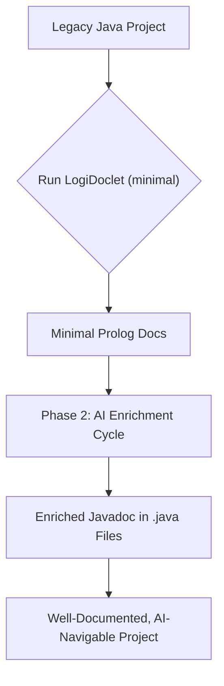
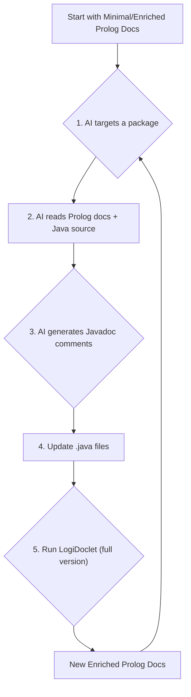

# LogiDoclet

[](https://github.com/grimch/logidoclet) [](https://opensource.org/licenses/MIT)

LogiDoclet is a Javadoc Doclet that generates a machine-readable Prolog representation of your Java codebase. It is designed to enable efficient, cost-effective, and deep analysis of software projects by AI agents, bridging the gap between legacy code and modern large language models.

## The Problem
In long-standing, in-house software projects, developer turnover is a significant challenge. New team members face a steep learning curve, trying to understand a large, complex codebase with incomplete or outdated documentation. This "knowledge gap" slows down development and hinders maintenance. Using AI to understand the code directly is often cost-prohibitive due to high token costs, context window limitations, and the low signal-to-noise ratio in raw source code.

## The Solution: A Semantic Indexer for Code
LogiDoclet addresses these challenges by acting as a **semantic indexer**. Instead of asking an AI to read an entire library, LogiDoclet provides it with a map—a compact, structured, and unambiguous set of Prolog facts. It's the difference between giving an AI a library card catalog versus telling it to read every book on every shelf.

### Key Features
*   **Massive Cost Reduction:** Drastically reduces token consumption (by over 90% in tests) for AI analysis compared to raw code.
*   **High-Density Information:** Provides a noise-free, structured view of the codebase's architecture, types, and their relationships.
*   **Enables Large-Scale Analysis:** The compact format allows an entire project's structure to fit within an AI's context window, enabling holistic architectural queries.
*   **Bootstraps Knowledge Transfer:** Facilitates a powerful workflow for documenting legacy code and accelerating developer onboarding.

## How It Works: The Two-Phase Approach
LogiDoclet is designed for an iterative loop that allows an AI to not only understand a codebase but to actively enrich it.

### Phase 1: Initial Scaffolding (Minimal Version)
First, run LogiDoclet to generate the **minimal** documentation. This version contains only the structural facts of your code (classes, methods, fields, relationships) without any comments. This serves as a low-cost, high-density "map" of the entire project.

### Phase 2: Incremental Enrichment (Full Version)
This phase creates a virtuous cycle of analysis and documentation:
1.  **Targeted Analysis:** Using the minimal "map," the AI targets a specific section of the code (e.g., a single package).
2.  **Deep Code Reading:** The AI reads the raw `.java` source files for *only that targeted section*.
3.  **Generate Understanding:** The AI generates high-quality, descriptive Javadoc comments.
4.  **Update Source Code:** These new Javadoc comments are written back into the `.java` files.
5.  **Regenerate Enriched Docs:** LogiDoclet is run again, this time to generate the **full** version (with comments).
6.  **Repeat:** The AI can now use the enriched documentation for even faster and more insightful analysis in the next cycle.

### Process Visualization

#### Overall Process


#### Phase 2 Enrichment Cycle


---

## User Guide

### Running LogiDoclet
To use LogiDoclet, invoke the standard `javadoc` tool and specify `LogiDoclet` as the doclet.

#### Options
*   `-d <directory>`: **(Required)** Specifies the output directory for the Prolog files.
*   `-outputCommentary`: (Optional) Includes Javadoc comments in the Prolog output. If omitted, a "minimal" version without comments is generated.
*   All other standard `javadoc` options like `--source-path` and `-subpackages` are supported.

#### Example Command
```bash
javadoc -doclet io.github.grimch.doclet.LogiDoclet \
        -d target/prolog-docs \
        -outputCommentary \
        --source-path src/main/java \
        -subpackages com.example.myproject
```

---

## Developer Guide

This guide provides information for developers who want to contribute to LogiDoclet itself.

### Prerequisites
*   Java Development Kit (JDK) 17 or later.
*   Apache Maven 3.6.0 or later.

### Building and Testing
LogiDoclet is a standard Maven project. To build the project, run the tests, and install it in your local repository, execute:
```bash
mvn clean install
```
This command will also run the integration test in `LogiDocletTest`, which generates Prolog facts for a sample project and compares them against an expected output.

### Core Concepts

#### Architecture Overview
LogiDoclet hooks into the `javadoc` toolchain. The tool parses the Java source and provides an Abstract Syntax Tree (AST) to our doclet, which then transforms the AST nodes into Prolog facts.

```mermaid
graph TD
    subgraph Javadoc Tool
        A[Java Source Code] --> B{javadoc};
    end

    subgraph LogiDoclet Core
        B -- Doclet API provides AST --> C[LogiDoclet.run()];
        C -- instantiates and runs --> D[PrologVisitor];
        D -- traverses AST --> D;
        D -- creates --> E[Prolog Data Model<br>(Fact, Atom, PrologList)];
        E -- are written by --> F[DocletPrologWriter];
    end

    subgraph Output
        F --> G[Prolog Files (*.pl)];
    end
```

#### Project Structure
```
.
├── pom.xml                 # Maven build configuration
└── src
    ├── main
    │   ├── java
    │   │   └── io/github/grimch/doclet
    │   │       ├── LogiDoclet.java         # Main doclet entry point
    │   │       └── prolog
    │   │           ├── PrologVisitor.java  # Traverses the Java AST
    │   │           ├── DocletPrologWriter.java # Writes facts to files
    │   │           └── *.java              # Prolog data model (Term, Fact, etc.)
    │   └── resources
    │       └── java_metastructure.pl # Defines the Prolog schema for the facts
    └── test
        ├── java                        # Unit and integration tests
        └── resources
            ├── sample_module           # A sample Java project for testing
            └── expected_output         # The expected Prolog output for the sample
```

#### Key Components
1.  **`LogiDoclet`**: The main class implementing `jdk.javadoc.doclet.Doclet`. It handles options and orchestrates the process.
2.  **`PrologVisitor`**: A `SimpleElementVisitor9` that does the core work. It traverses the AST elements (modules, packages, types, methods) provided by the Doclet API.
3.  **Prolog Data Model (`Term`, `Fact`, `Atom`, `PrologList`)**: A set of classes that represent Prolog constructs. The `PrologVisitor` builds a tree of these objects, which can then be serialized into valid Prolog syntax via their `toString()` methods.
4.  **`DocletPrologWriter`**: Manages the creation of the output directory structure and writes the generated Prolog facts into `.pl` files.

### Contributing
Contributions are welcome! Please follow these guidelines:
1.  **Code Style:** Adhere to the existing code style and formatting.
2.  **Add Javadoc:** Document all new public classes and methods.
3.  **Add Tests:** All new features or bug fixes must be accompanied by a corresponding test case. If you modify the output format, update the files in `src/test/resources/expected_output`.
4.  **Create Issues:** For major changes, please open an issue first to discuss the proposed changes.

## License
This project is licensed under the MIT License - see the [LICENSE.md](LICENSE.md) file for details.