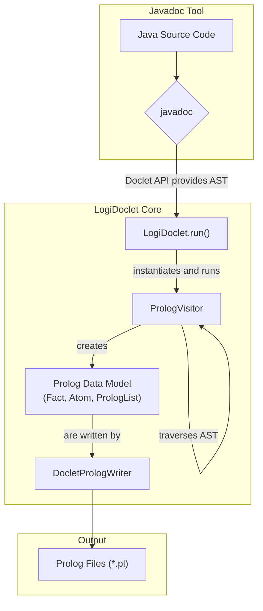

# LogiDoclet


[](https://www.oracle.com/java/technologies/javase/jdk17-archive-downloads.html)
[](https://github.com/grimch/logidoclet/releases)
[](https://github.com/grimch/logidoclet/stargazers)
[](https://github.com/grimch/logidoclet/network)
[](https://github.com/grimch/logidoclet/commits/main)
[](https://github.com/grimch/logidoclet)
[](https://opensource.org/licenses/MIT)

LogiDoclet is a Javadoc Doclet that generates a LLM-friendly representation of your Java codebase. It is designed to make software projects more accessible for analysis by AI agents and large language models.

## Motivation for LogiDoclet: Javadoc must become AI-friendly
As human Java developers, if we need more information about a library's API, we consult API documentation like Javadoc, which gives us detailed descriptions of public and protected classes, interfaces, constructors, methods, fields, class inheritance, and so on.

The problem with Javadoc however, when looking from the AI perspective, is that it is Presentation-Oriented, designed for human eyes. Information is embedded within complex HTML tags, CSS classes, and scripts. This requires high effort and high token consumption for the LLM to process.

What the AI truly prefers is a compact, logical, structured, and unambiguous set of 'facts.' which makes the same it instantly machine-readable.

LogiDoclet addresses these challenges by acting as a **semantic indexer**, which provides a compact, structured, and unambiguous set of facts representing the codebase.

**Major usage scenarios:**
*  **Integrated Development Environments** are parsing your source files to build an internal representation of the code called an Abstract Syntax Tree (AST). When required information from external libraries/binaries is retrieved from their repective bytecode metadata.<br>
**Code Assistance plugins** hace access to this, but it lacks any information about libraries or frameworks not used yet in the project, which is th typical scenario when you do a major (re-)design.<br>
It would therefore help a lot, if the repective projects generate an additional AI-friendly Javadoc version. 

* **Command Line AI Code assistance tools** like **Gemini CLI** do not have access to any AST based information. They completely rely on analysing the code "ad-hoc" resulting in hight token consumption.<br>
LogiDoclet will provide them at least to the **full API documentation of their project**, therefor reducing the need for direct code analysis substantially.

___

## User Guide

There are two primary ways to use LogiDoclet:
* Directly via the `javadoc` command-line tool
* As a plugin in a Gradle / Maven build.

### 1. Direct javadoc Execution

To use LogiDoclet, you invoke the standard `javadoc` tool and specify `LogiDoclet` as the doclet. This method is useful for quick analysis or for use in non-Maven projects.

#### Options
*   `-d <directory>`: **(Required)** Specifies the output directory. **It is highly recommended to use a directory outside of `target/`** (e.g., `build/prolog-docs`) to prevent generated files from being deleted by `mvn clean`.
*   `-docletpath <path_to_jar>`: **(Required)** Specifies the path to the LogiDoclet JAR file. You must build the project first (`mvn clean install`) to create this JAR in the `target/` directory.
*   `-outputCommentary`: (Optional) Includes Javadoc comments in the Prolog output. If omitted, a "minimal" version without comments is generated.
*   All other standard `javadoc` options like `--source-path` and `-subpackages` are supported.

#### Example Commands

**Generating docs for a project:**
```bash
# First, build LogiDoclet to create the JAR
# mvn clean install

# Then, run javadoc on your own project
javadoc -doclet io.github.grimch.doclet.LogiDoclet \
        -docletpath 'path/to/logidoclet/target/logidoclet-1.0.0.jar' \
        -d build/prolog-docs \
        --source-path path/to/your/project/src/main/java \
        -subpackages com.your.project.packages
```

**Generating docs for the included sample:**
This command generates Prolog facts for the sample code included in this repository's test resources.
```bash
# Assumes you have built the project with 'mvn clean install, for a Gradle build, the library is located in build/libs directory
javadoc -doclet io.github.grimch.doclet.LogiDoclet \
        -docletpath 'target/logidoclet-1.0.0.jar' \
        -d build/prolog-sample-docs \
        --source-path src/test/resources/sample_module \
        -subpackages io.github.grimch.doclet.sample_module
```

### 2. Usage with Maven

You can integrate LogiDoclet directly into your project's `pom.xml` using the `maven-javadoc-plugin`.

#### Setup
1.  **Install LogiDoclet Locally:** Since it is not yet available on Maven Central. You must build and install it locally first:
    ```bash
    # In the logidoclet project directory
    mvn clean install
    ```
2.  **Configure Your `pom.xml`:** Add the `maven-javadoc-plugin` to your project's `pom.xml` and configure it to use LogiDoclet.

An example `pom.xml` is provided in the [`examples/logidoclet-usage/`](./examples/logidoclet-usage/) directory. You can adapt the `<plugin>` section from this file into your own project.

Key configuration snippet from the example which shows how generate standard javadoc and LogiDoc output in parallel:

```xml
<plugin>
    <groupId>org.apache.maven.plugins</groupId>
    <artifactId>maven-javadoc-plugin</artifactId>
    <version>${maven.javadoc.plugin.version}</version>
    <configuration>
        <!-- uncomment next two lines for troubleshooting -->
        <debug>true</debug>
        <verbose>true</verbose>
    </configuration>

    <executions>
        <execution>
            <id>default-javadoc</id>
            <phase>compile</phase>
            <goals>
                <goal>javadoc</goal>
            </goals>
            <configuration>
                <classifier>default-javadoc</classifier>
                <outputDirectory>${project.build.directory}/javadoc</outputDirectory>
                <show>private</show>
            </configuration>
        </execution>

        <execution>
            <id>logidoclet-javadoc</id>
            <phase>compile</phase>
            <goals>
                <goal>javadoc</goal>
            </goals>
            <configuration>
                <classifier>logidoclet-javadoc</classifier>
                <!-- uncomment next two lines for troubleshooting -->
                <!-- The next is necessary because otherwise LogiDoclet will respective parameter -->
                <disableNoFonts>true</disableNoFonts>
                <doclet>io.github.grimch.doclet.LogiDoclet</doclet>
                <docletArtifact>
                    <groupId>io.github.grimch</groupId>
                    <artifactId>logidoclet</artifactId>
                    <version>${logidoclet.version}</version>
                </docletArtifact>
                <useStandardDocletOptions>false</useStandardDocletOptions>
                <additionalOptions>
                    <!-- Pass the output directory to your custom doclet -->
                    <additionalOption>-d ${logidoc.output.directory}</additionalOption>
                    <!-- Pass the outputCommentary flag -->
                    <!-- Comment out the line below to enable full output -->
                    <additionalOption>-outputCommentary</additionalOption>
                    <!-- Pass the prettyPrint flag -->
                    <!-- Comment out the line below to enable full output -->
                    <!-- Note: tokenization is more efficient wit this disabled -->
                    <additionalOption>-prettyPrint</additionalOption>
                </additionalOptions>
            </configuration>
        </execution>
    </executions>
</plugin>

```

### 3. Usage with Gradle

You can integrate LogiDoclet directly into your project's `build.gradle` by registering  `logidocletJavadoc` task.

#### Setup
1.  **Install LogiDoclet Locally:** Since it is not yet available on Maven Central. You must build and install it locally first:
    ```bash
    # In the logidoclet project directory
    gradle clean publishToMavenLocal
    ```
2.  **Configure Your `pom.xml`:** Add the `maven-javadoc-plugin` to your project's `pom.xml` and configure it to use LogiDoclet.

An example `build.gradle` is provided in the [`examples/logidoclet-usage/`](./examples/logidoclet-usage/) directory. You can adapt the `logidoclet` configuration, dependency and task registration from this file into your own project.

Key configuration snippet from the example which shows how generate standard javadoc and LogiDoc output in parallel:

```groovy
configurations {
    logidoclet
}

dependencies {
    logidoclet "io.github.grimch:logidoclet:1.0.0"
}

tasks.register('defaultJavadoc', Javadoc) {
    source = sourceSets.main.allJava
    classpath = sourceSets.main.compileClasspath
    destinationDir = file("${buildDir}/javadoc")
    options.showAll()
}

tasks.register('logidocletJavadoc', Javadoc) {
    source = sourceSets.main.allJava
    classpath = sourceSets.main.compileClasspath
    destinationDir = logidocOutputDirectory.get().asFile
    title = null

    options.author = false
    options.version = false
    options.noTimestamp = false
    options.windowTitle = null
    options.docTitle = null
    options.footer = null

    options.addBooleanOption('no-fonts', true)
    options.doclet = 'io.github.grimch.doclet.LogiDoclet'
    options.docletpath = configurations.logidoclet.files.asType(List)

    // Pass the output directory to your custom doclet
    // options.addStringOption('-d', logidocOutputDirectory.get().asFile.absolutePath)
    // Pass the outputCommentary flag
    // Comment out the line below to enable full output
    options.addStringOption('outputCommentary', 'true')
    // Pass the prettyPrint flag
    // Comment out the line below to enable full output
    // Note: tokenization is more efficient with this disabled
    options.addStringOption('prettyPrint', 'true')
}
```


#### Standalone Example Project
To make it easy to experiment, a complete, runnable Maven example is provided in the [`examples/logidoclet-usage/`](./examples/logidoclet-usage/) directory.

**To run the example:**
1.  **Navigate to the example directory:**
    ```bash
    cd examples/logidoclet-usage
    ```
2.  **Run the setup script:** This will copy the sample source from *src/test/resources/sample_module* into the example project.
    *   On Linux or macOS:
        ```bash
        bash setup_example.sh
        ```
    *   On Windows:
        ```cmd
        setup_example.bat
        ```
3. **Generate the Javadoc** 
   * **Using Maven (Note that you need to explitly run Maven `compile` phase and not `javadoc:javadoc` goal for maven to run both executions!):**
     ```bash
     mvn clean compile
     ```
     ****

   * **Using Gradle:**
     ```bash
      gradle clean defaultJavadoc logidocletJavadoc
     ```  
In both cases the Prolog documentation will be generated in the `examples/logidoclet-usage/llm-context/apidocs` directory. Output will be full output (inlcuding comments) and formatted.

Also for both cases standard Javadoc output will be generated as well is respective default output folders for comparison purposes.

### Additional Output Files for AI Tool Integration

LogiDoclet generates three files in the specified output directory (`-d` option), which are crucial for AI agent integration:

*   **[`LLM_context.md`](src/main/resources/LLM_context.md)**: Algorithmic guide defining the steps an LLM must follow to parse the LogiDoclet Prolog Javadoc output.
*   **[`java_metastructure.pl`](src/main/resources/java_metastructure.pl)**: This file defines the Prolog schema (predicates and their arities) used to represent the Java codebase. It's essential for any Prolog-based AI agent to correctly interpret the generated facts.
*   **[`templates/master_LLM_context.md.template`](src/main/resources/master_LLM_context_template.md)**: This file serves as a structured template for initializing AI tools like Claude Code and Gemini CLI. It is designed to be copied directly into your project's root directory (or a designated context directory for your AI tool) under a suitable name (e.g., `gemini.md` or `claude.md`). The AI tool is then expected to interpret this file, which contains references to `LLM_context.md` and the generated Prolog facts, to establish its initial context about the codebase.

### Formatted Prolog Output Example

To illustrate the output of LogiDoclet, you can examine the Java classes used for unit testing and their corresponding expected formatted Prolog representation. The `-prettyPrint` option was used to generate this output.

*   **Sample Java Source Files:** [`src/test/resources/sample_module`](./src/test/resources/sample_module)
*   **Expected Formatted Prolog Output Files:** [`src/test/resources/expected_output/full`](./src/test/resources/expected_output/full)

---
## Developer Guide

This guide provides information for developers who want to contribute to LogiDoclet itself.

### Prerequisites
*   Java Development Kit (JDK) 17 or later.
*   Apache Maven 3.6.0 or later.

### Building and Testing
LogiDoclet can be built with either Maven or Gradle. To build the project, run the tests, and install it in your local repository, 
execute either :
```bash
mvn clean install
```
or
```bash
gradle clean publishToMavenLocal
```
This build will also run the integration test in `LogiDocletTest`, which generates Prolog facts for a sample project and compares them against an expected output.

### Core Concepts

#### Architecture Overview
LogiDoclet hooks into the `javadoc` toolchain. The tool parses the Java source and provides an Abstract Syntax Tree (AST) to our doclet, which then transforms the AST nodes into Prolog facts.



#### Project Structure
```
.
├── pom.xml                 # Maven build configuration
└── src
    ├── main
    │   ├── java
    │   │   └── io/github/grimch/doclet
    │   │       ├── LogiDoclet.java         # Main doclet entry point
    │   │       └── prolog
    │   │           ├── PrologVisitor.java       # Traverses the Java AST
    │   │           ├── DocletPrologWriter.java  # Writes facts to files
    │   │           ├── PrettyPrinter.java       # Formats output for better readability (note that this will make tokenizazion less efficient).
    │   │           └── *.java                   # Prolog data model (Term, Fact, etc.)
    │   └── resources
    │       └── java_metastructure.pl            # Algorithmic guide defining the steps an LLM must follow to parse the LogiDoclet Prolog Javadoc output.
    │       └── jLLM_context.md                  # Information for the LLM how to use/traverse the javadoc information.
    │       └── master_LLM_context_template.md   # A template for the initial context file at the project root folder (see above).
    └── test
        ├── java                        # Unit and integration tests
        └── resources
            ├── sample_module           # A sample Java project for testing
            └── expected_output         # The expected Prolog output for the sample
```

#### Key Components
1.  **`LogiDoclet`**: The main class implementing `jdk.javadoc.doclet.Doclet`. It handles options and orchestrates the process.
2.  **`PrologVisitor`**: A `SimpleElementVisitor9` that does the core work. It traverses the AST elements (modules, packages, types, methods) provided by the Doclet API.
3.  **Prolog Data Model (`Term`, `Fact`, `Atom`, `PrologList`)**: A set of classes that represent Prolog constructs. The `PrologVisitor` builds a tree of these objects, which can then be serialized into valid Prolog syntax via their `toString()` methods.
4.  **`DocletPrologWriter`**: Manages the creation of the output directory structure and writes the generated Prolog facts into `.pl` files.

---

## License
This project is licensed under the MIT License - see the [LICENSE.md](LICENSE.md) file for details.
