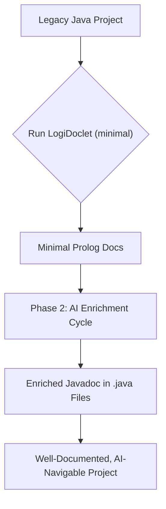
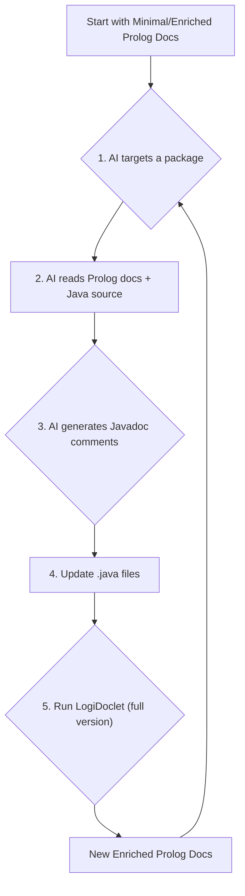
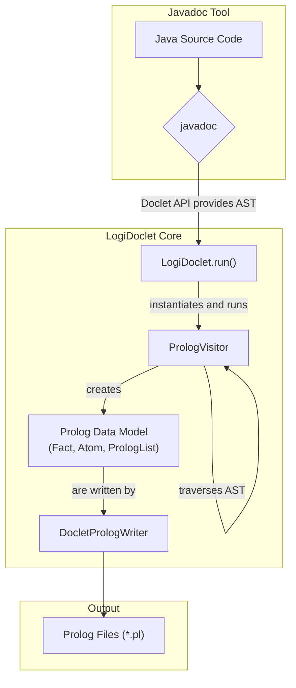

# LogiDoclet

[](https://github.com/grimch/logidoclet) [](https://opensource.org/licenses/MIT)

LogiDoclet is a Javadoc Doclet that generates a machine-readable Prolog representation of your Java codebase. It is designed to enable efficient, cost-effective, and deep analysis of software projects by AI agents, bridging the gap between legacy code and modern large language models.

## The Problem
In long-standing, in-house software projects, developer turnover is a significant challenge. New team members face a steep learning curve, trying to understand a large, complex codebase with incomplete or outdated documentation. This "knowledge gap" slows down development and hinders maintenance. Using AI to understand the code directly is often cost-prohibitive due to high token costs, context window limitations, and the low signal-to-noise ratio in raw source code.

## The Solution: A Semantic Indexer for Code
LogiDoclet addresses these challenges by acting as a **semantic indexer**. Instead of asking an AI to read an entire library, LogiDoclet provides it with a map—a compact, structured, and unambiguous set of Prolog facts. It's the difference between giving an AI a library card catalog versus telling it to read every book on every shelf.

### Key Features
*   **Massive Cost Reduction:** Drastically reduces token consumption (by over 90% in tests) for AI analysis compared to raw code.
*   **High-Density Information:** Provides a noise-free, structured view of the codebase's architecture, types, and their relationships.
*   **Enables Large-Scale Analysis:** The compact format allows an entire project's structure to fit within an AI's context window, enabling holistic architectural queries.
*   **Bootstraps Knowledge Transfer:** Facilitates a powerful workflow for documenting legacy code and accelerating developer onboarding.

## How It Works: The Two-Phase Approach
LogiDoclet is designed for an iterative loop that allows an AI to not only understand a codebase but to actively enrich it.

### Phase 1: Initial Scaffolding (Minimal Version)
First, run LogiDoclet to generate the **minimal** documentation. This version contains only the structural facts of your code (classes, methods, fields, relationships) without any comments. This serves as a low-cost, high-density "map" of the entire project.

### Phase 2: Incremental Enrichment (Full Version)
This phase creates a virtuous cycle of analysis and documentation:
1.  **Targeted Analysis:** Using the minimal "map," the AI targets a specific section of the code (e.g., a single package).
2.  **Deep Code Reading:** The AI reads the raw `.java` source files for *only that targeted section*.
3.  **Generate Understanding:** The AI generates high-quality, descriptive Javadoc comments.
4.  **Update Source Code:** These new Javadoc comments are written back into the `.java` files.
5.  **Regenerate Enriched Docs:** LogiDoclet is run again, this time to generate the **full** version (with comments).
6.  **Repeat:** The AI can now use the enriched documentation for even faster and more insightful analysis in the next cycle.

### Process Visualization

#### Overall Process


#### Phase 2 Enrichment Cycle


---\n
## User Guide

There are two primary ways to use LogiDoclet: directly via the `javadoc` command-line tool, or as a plugin in a Maven build.

### 1. Direct `javadoc` Execution

To use LogiDoclet, you invoke the standard `javadoc` tool and specify `LogiDoclet` as the doclet. This method is useful for quick analysis or for use in non-Maven projects.

#### Options
*   `-d <directory>`: **(Required)** Specifies the output directory. **It is highly recommended to use a directory outside of `target/`** (e.g., `build/prolog-docs`) to prevent generated files from being deleted by `mvn clean`.
*   `-docletpath <path_to_jar>`: **(Required)** Specifies the path to the LogiDoclet JAR file. You must build the project first (`mvn clean install`) to create this JAR in the `target/` directory.
*   `-outputCommentary`: (Optional) Includes Javadoc comments in the Prolog output. If omitted, a "minimal" version without comments is generated.
*   All other standard `javadoc` options like `--source-path` and `-subpackages` are supported.

#### Example Commands

**Generating docs for a project:**
```bash
# First, build LogiDoclet to create the JAR
# mvn clean install

# Then, run javadoc on your own project
javadoc -doclet io.github.grimch.doclet.LogiDoclet \
        -docletpath 'path/to/logidoclet/target/logidoclet-1.0.0.jar' \
        -d build/prolog-docs \
        --source-path path/to/your/project/src/main/java \
        -subpackages com.your.project.packages
```

**Generating docs for the included sample:**
This command generates Prolog facts for the sample code included in this repository's test resources.
```bash
# Assumes you have built the project with 'mvn clean install'
javadoc -doclet io.github.grimch.doclet.LogiDoclet \
        -docletpath 'target/logidoclet-1.0.0.jar' \
        -d build/prolog-sample-docs \
        --source-path src/test/resources/sample_module \
        -subpackages io.github.grimch.doclet.sample_module
```

### 2. Usage with Maven

You can also integrate LogiDoclet directly into your project's `pom.xml` using the `maven-javadoc-plugin`.

#### Setup
1.  **Install LogiDoclet Locally:** Since it is not yet available on Maven Central. You must build and install it locally first:
    ```bash
    # In the logidoclet project directory
    mvn clean install
    ```
2.  **Configure Your `pom.xml`:** Add the `maven-javadoc-plugin` to your project's `pom.xml` and configure it to use LogiDoclet.

An example `pom.xml` is provided in the [`examples/maven-usage/`](./examples/maven-usage/) directory. You can adapt the `<plugin>` section from this file into your own project.

Key configuration snippet from the example:
```xml
<plugin>
    <groupId>org.apache.maven.plugins</groupId>
    <artifactId>maven-javadoc-plugin</artifactId>
    <version>${maven.javadoc.plugin.version}</version>
    <configuration>
        <debug>true</debug>
        <verbose>true</verbose>
        <disableNoFonts>true</disableNoFonts>
        <subpackages>io.github.grimch.doclet.sample_module</subpackages>
        <doclet>io.github.grimch.doclet.LogiDoclet</doclet>
        <docletArtifact>
            <groupId>io.github.grimch</groupId>
            <artifactId>logi-doclet</artifactId>
            <version>${logi-doclet.version}</version>
        </docletArtifact>
        <useStandardDocletOptions>false</useStandardDocletOptions>
        <additionalOptions>
            <!-- Pass the output directory to your custom doclet -->
            <additionalOption>-d ${logidoc.output.directory}</additionalOption>
            <!-- Pass the outputCommentary flag -->
            <!-- Uncomment the line below to enable commentary output -->
            <!-- additionalOption>-outputCommentary</additionalOption -->
        </additionalOptions>
    </configuration>
</plugin>
```
#### Standalone Example Project
To make it easy to experiment, a complete, runnable Maven example is provided in the [`examples/maven-usage/`](./examples/maven-usage/) directory.

**To run the example:**
1.  **Navigate to the example directory:**
    ```bash
    cd examples/maven-usage
    ```
2.  **Run the setup script:** This will copy the sample source from *src/test/resources/sample_module* into the example project.
    *   On Linux or macOS:
        ```bash
        bash setup_example.sh
        ```
    *   On Windows:
        ```cmd
        setup_example.bat
        ```
3.  **Run the Maven javadoc plugin:**
    ```bash
    mvn javadoc:javadoc
    ```
    The Prolog documentation will be generated in the `examples/maven-usage/build/prolog-docs` directory.

---
## Developer Guide

This guide provides information for developers who want to contribute to LogiDoclet itself.

### Prerequisites
*   Java Development Kit (JDK) 17 or later.
*   Apache Maven 3.6.0 or later.

### Building and Testing
LogiDoclet is a standard Maven project. To build the project, run the tests, and install it in your local repository, execute:
```bash
mvn clean install
```
This command will also run the integration test in `LogiDocletTest`, which generates Prolog facts for a sample project and compares them against an expected output.

### Core Concepts

#### Architecture Overview
LogiDoclet hooks into the `javadoc` toolchain. The tool parses the Java source and provides an Abstract Syntax Tree (AST) to our doclet, which then transforms the AST nodes into Prolog facts.



#### Project Structure
```
.
├── pom.xml                 # Maven build configuration
└── src
    ├── main
    │   ├── java
    │   │   └── io/github/grimch/doclet
    │   │       ├── LogiDoclet.java         # Main doclet entry point
    │   │       └── prolog
    │   │           ├── PrologVisitor.java  # Traverses the Java AST
    │   │           ├── DocletPrologWriter.java # Writes facts to files
    │   │           └── *.java              # Prolog data model (Term, Fact, etc.)
    │   └── resources
    │       └── java_metastructure.pl # Defines the Prolog schema for the facts
    └── test
        ├── java                        # Unit and integration tests
        └── resources
            ├── sample_module           # A sample Java project for testing
            └── expected_output         # The expected Prolog output for the sample
```

#### Key Components
1.  **`LogiDoclet`**: The main class implementing `jdk.javadoc.doclet.Doclet`. It handles options and orchestrates the process.
2.  **`PrologVisitor`**: A `SimpleElementVisitor9` that does the core work. It traverses the AST elements (modules, packages, types, methods) provided by the Doclet API.
3.  **Prolog Data Model (`Term`, `Fact`, `Atom`, `PrologList`)**: A set of classes that represent Prolog constructs. The `PrologVisitor` builds a tree of these objects, which can then be serialized into valid Prolog syntax via their `toString()` methods.
4.  **`DocletPrologWriter`**: Manages the creation of the output directory structure and writes the generated Prolog facts into `.pl` files.

## License
This project is licensed under the MIT License - see the [LICENSE.md](LICENSE.md) file for details.
