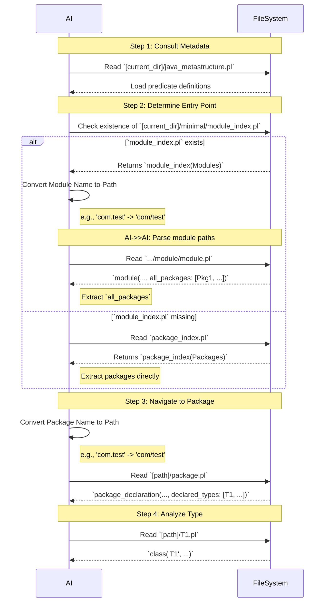

# Guide for AI: Navigating LogiDoclet Prolog Output

This document provides instructions for an AI to efficiently understand and interact with the Prolog-based Javadoc output.

**Important Definition**: `[current_dir]` means the directory where the current document is located.

## 1. Schema and Retrieval Process

* ** You must always follow this process to identify any packages or types in the Javadoc!**

* Javadoc output is located in `[current_dir]/minimal`
* packages and module names need to be tranlated into file paths, e.g., 'com.test' -> 'com/test'. 
* The master schema, bootstrap process, and type system are all documented directly within the header of **`[current_dir]/java_metastructure.pl`**.
* To understand this codebase, you MUST read and follow the instructions in that file's header first. It is the single source of truth.
* 
* **If you MUST NOT try to read a module package or type file which is not contained in the repective index. If there is no entry in the index there will be no file either.**
* **If something for you is unclear or ambiguous about this flow inform the user and propose a moidification of this file.**

### Visual Sequence Description of the above Retrieval Process

## 3. Minimal vs. Full Output Modes

There is a potential second version of the Prolog output located in `[current_dir]/full/`. This version includes all Javadoc comments extracted from the source code.

**Strategy for AI:**
*   Always start with the **Minimal Version** (as described in `java_metastructure.pl`) to map the project structure.
*   Switch to the **Full Version** for specific classes, methods, or fields when detailed documentation is needed for a particular task (e.g., explaining a method, generating new code, or refactoring).