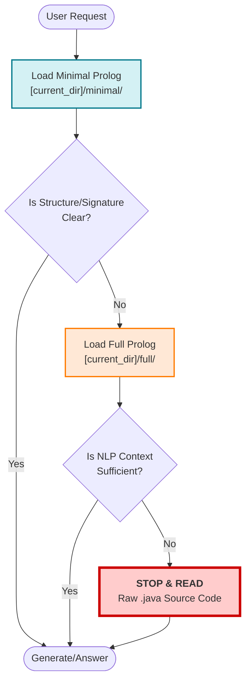
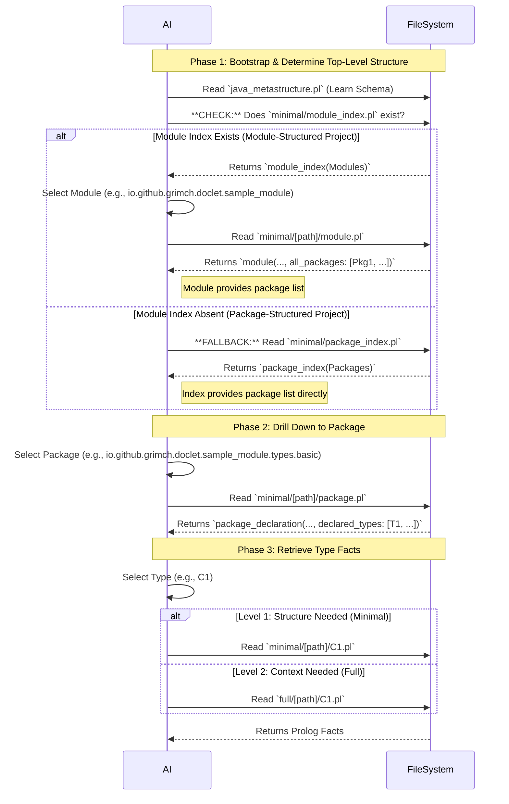

# Guide for AI: Navigating LogiDoclet Prolog Output

This document establishes the protocol for efficiently understanding this project using Prolog-based Javadoc facts.

**Important Definition**: `[current_dir]` means the directory where this document is located.

## 1. The Token Conservation Strategy
**Goal**: Minimize the reading of raw source code.
**Rule**: Use the Javadoc (Prolog) to determine class structures, method signatures, and dependencies.

When tasked with generating new code (e.g., a Controller calling a Persistence service) or refactoring, follow this strict Hierarchy of Information Retrieval:

1.  **Level 1: Minimal Facts** (Structure, Relations, Inheritance)
2.  **Level 2: Full Facts** (Javadoc Text, Natural Language Intent)
3.  **Level 3: Source Code** (Implementation Details - **Last Resort**)

### Visual Strategy: Decision Flow

## 2. Schema and Navigation Requirements

To execute **Level 1** and **Level 2** above, you must navigate the file system correctly.

### A. Initialization
* **Schema**: You **MUST** read **`[current_dir]/java_metastructure.pl`** first to understand the predicates (names and arguments) used in the `.pl` files.
* **Index**: You **MUST** determine the top-level structure (Module or Package) by checking for the module index file first. **Do not guess paths.**

### B. Navigation Logic (Sequential Top-Down Search Process)
The doclet output is structured **EITHER** by modules **OR** by packages, but not both. You must check for the highest-level structure first:

1.  **Check for Module Structure**: Attempt to read `minimal/module_index.pl`.
2.  **If Module Index Exists**: The project is Module-Structured. Use the Module Index to find modules, and then read the respective `module.pl` files to find the packages exported by that module. (Path: Module Index $\rightarrow$ Module $\rightarrow$ Package $\rightarrow$ Type)
3.  **If Module Index is Absent**: The project is Package-Structured. Use the fallback `minimal/package_index.pl` file to find packages directly. (Path: Package Index $\rightarrow$ Package $\rightarrow$ Type)
4.  **Resolve Path**: Translate Java names (e.g., `com.example`) to file paths (`com/example`).
5.  **Modes**: Use `minimal/` for structure and `full/` when Javadoc comments are needed.

### Visual Navigation: File System Sequence
