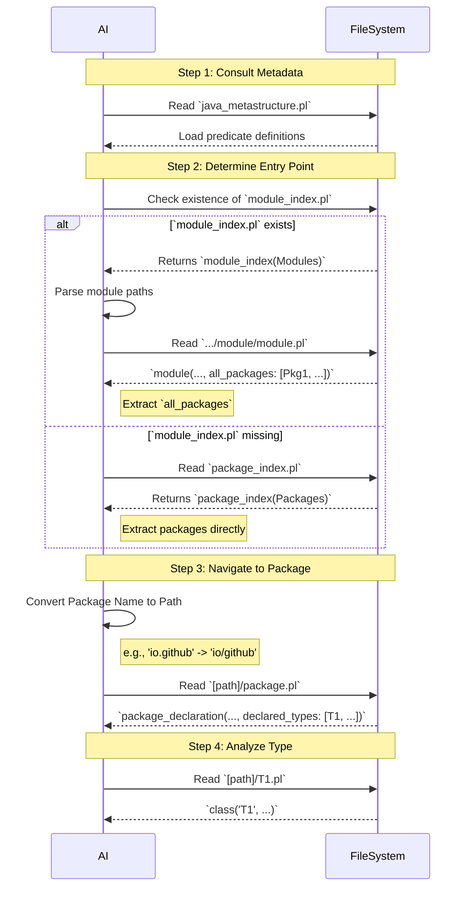

# Guide for AI: Navigating LogiDoclet Prolog Output

This document provides instructions for an AI to efficiently understand and interact with the Prolog-based Javadoc output generated by LogiDoclet.

**Important Definition**: `[current_dir]` means the directory where the current document is located.

## 1. Output Structure and Format

The Javadoc information is presented as Prolog facts. Each fact represents a specific Java element (e.g., module, class, method, field) and its properties.

## 2. The Retrieval Process

To find information, follow this strict order of operations:

1.  **Consult Metadata:**
    * Read `[current_dir]/java_metastructure.pl` first.
    * This file defines the arity and types for all predicates, including the entry points `module_index/1` and `package_index/1`.

2.  **Determine Entry Point (Index Analysis):**
    * **Check for Modular Project:** Attempt to read `[current_dir]/minimal/module_index.pl`.
        * **If found:** The project is modular. The root predicate is `module_index/1` containing a list of `module_name`.
    * **Check for Non-Modular Project:** If the module index is missing, read `[current_dir]/minimal/package_index.pl`.
        * **If found:** The project is non-modular. The root predicate is `package_index/1` containing a list of `package_name`.

3.  **Resolve Packages:**
    * **Scenario A: Modular (`module_index.pl` exists):**
        * Iterate through the list of modules.
        * Convert the module name to a path (replace dots `.` with slashes `/`).
        * Navigate to `[current_dir]/minimal/[module_path]/module.pl`.
        * Extract the `all_packages` argument (7th argument of `module/7`) to get the list of packages.
    * **Scenario B: Non-Modular (`package_index.pl` exists):**
        * Use the list of packages found directly in the `package_index/1` predicate.

4.  **Discover Types:**
    * For each package identified, convert the package name into a file path (e.g., `io.github.grimch` becomes `io/github/grimch`).
    * Navigate to `[current_dir]/minimal/[package_path]/package.pl`.
    * Find the `package_declaration/2` fact and extract the `declared_types` list (2nd argument).

5.  **Analyze Type Definitions:**
    * For each type name found in the package declaration, navigate to its dedicated `.pl` file in the same directory (e.g., `MyClass.pl`).
    * Retrieve detailed facts using predicates such as `class/10`, `interface/9`, `record/9`, or `enum/8`.

## 3. Visual Flow

## 3. Minimal vs. Full Output Modes

There is a potential second version of the Prolog output located in `[current_dir]/full/`. This version includes all Javadoc comments extracted from the source code.

**Strategy for AI:**
*   Always start with the **Minimal Version** (as described above) to map the project structure.
*   Switch to the **Full Version** for specific classes, methods, or fields when detailed documentation is needed for a particular task (e.g., explaining a method, generating new code, or refactoring).
