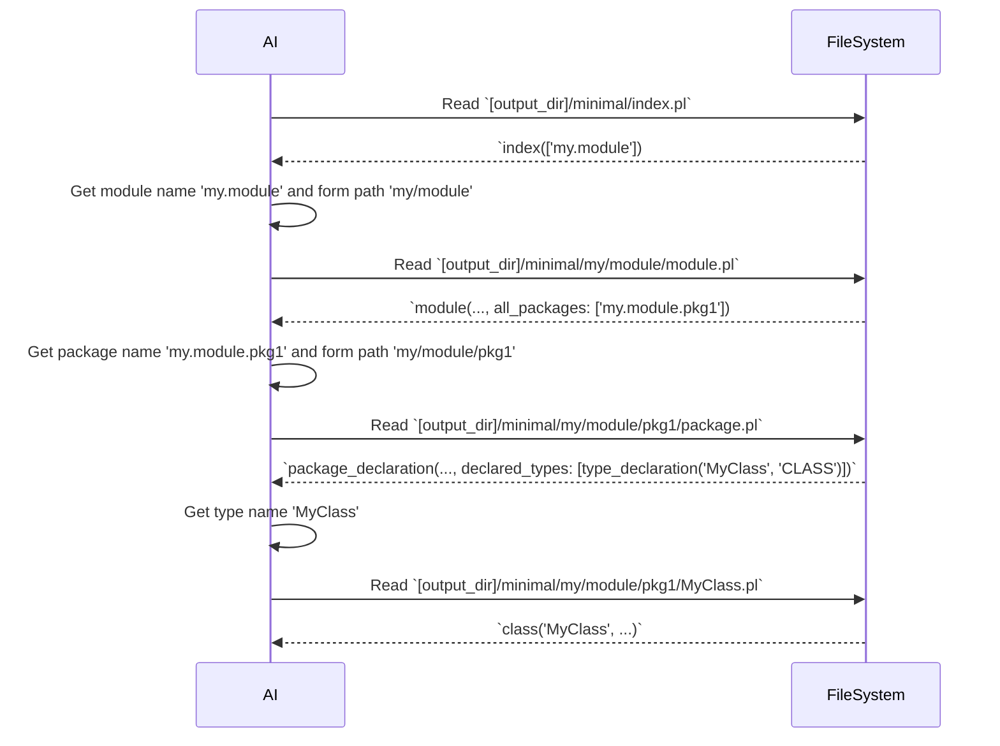

# Guide for AI: Navigating LogiDoclet Prolog Output

This document provides instructions for an AI to efficiently understand and interact with the Prolog-based Javadoc output generated by LogiDoclet.

## 1. Output Structure and Format

The Javadoc information is presented as Prolog facts. Each fact represents a specific Java element (e.g., module, class, method, field) and its properties.

## 2. Understanding the Schema (Metadata First!)

Before attempting to parse any Prolog output, **always consult the metadata file**:
*   `java_metastructure.pl`

This file defines all the Prolog predicates used, their arity (number of arguments), and the expected type and meaning of each argument. It is crucial for correctly interpreting the Prolog facts.

**Location of Metadata:** The `java_metastructure.pl` file is copied to the *root* of the output directory (e.g., `target/test-output/java_metastructure.pl`). The `gemini.md` file itself is also copied to this root.

## 3. Step-by-Step Exploration Strategy

To understand a project's structure, follow the hierarchical exploration path shown in the diagram below.

**Important Note on Paths:** To navigate the directory structure, you must convert the dot-separated module and package names (e.g., `io.github.grimch.doclet.sample_module`) into a relative path by replacing the dots (`.`) with your filesystem's directory separator (e.g., `io/github/grimch/doclet/sample_module`).

The process is as follows:

*   **Start with the Index:** Begin by reading `index.pl` to get the list of all top-level modules.
*   **Explore Modules:** For each module, navigate to its `module.pl` file. This file contains the `all_packages` argument, which lists all packages within that module.
*   **Discover Packages:** For each package, navigate to its `package.pl` file to find all the types declared within it.
*   **Analyze Types:** For each type, navigate to its dedicated `.pl` file (e.g., `MyClass.pl`) to get detailed facts about its definition, members, and documentation.

## 4. Minimal vs. Full Output Modes

LogiDoclet generates two versions of the Prolog output, controlled by the `-outputCommentary` flag during generation:

*   **Minimal Version (Default):** Located in `[output_dir]/minimal/`. This version contains only the structural information of the Java code. Javadoc comments are represented as empty strings (`""`) in the `doc_comment` argument of predicates. Use this for a quick, token-efficient overview of the codebase structure.
*   **Full Version:** Located in `[output_dir]/full/`. This version includes all Javadoc comments extracted from the source code, with line breaks escaped as `\n`. Use this version when a deeper understanding of the code's intent, usage, and detailed documentation is required.

**Strategy for AI:**
*   Always start with the **Minimal Version** to get a high-level understanding and navigate the codebase efficiently.
*   Switch to the **Full Version** for specific classes, methods, or fields when detailed documentation is needed for a particular task (e.g., explaining a method, generating new code, or refactoring).

## 5. Handling Undefined Types in Metadata

Any type referenced in `argument_info` that is *not* explicitly defined by a `predicate_info` fact within `java_metastructure.pl` should be considered an **atomic type** (e.g., `atom`, `string`, `integer`, `float`).