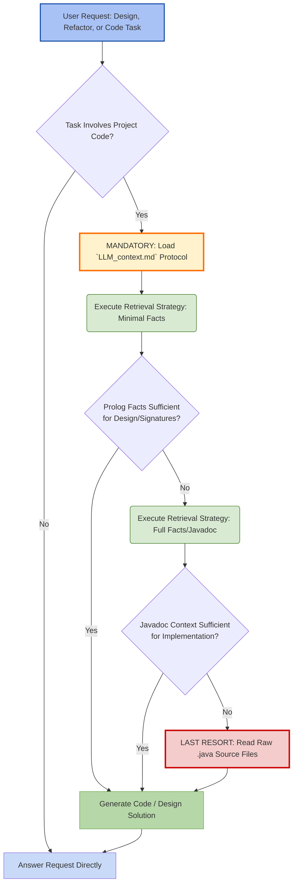

# Project Knowledge Base & Navigation

> **Note to Developer:** Append this content to your project's root-level AI instructions. Ensure the path `llm-context/apidocs/` matches your generation output.

## ⚡ Core Protocol: Javadoc-First Development

To ensure high-quality code generation and minimize token consumption, you must adhere to the **LogiDoclet Protocol**.

**Mandatory Initialization:**
Before undertaking **ANY** code-altering, code-designing, or dependency-mapping task — including, but not limited to, **designing new components** (e.g., a Controller tier), **overhauling existing architecture** (refactoring) — you **MUST** read and apply the instructions found in:
👉 **`llm-context/apidocs/LLM_context.md`**

**The Golden Rule:**
Treat the Prolog-based Javadoc defined in that context file as the **Primary Source of Truth and Design Specification**. You are strictly forbidden from analyzing raw `.java` source files unless the Prolog documentation explicitly fails to provide the necessary method signatures or structural relationships required for the intended design or implementation.

---

### 🗺️ LLM Execution Mandate Flowchart

This diagram represents the **non-negotiable order** of operations for processing any code request.

