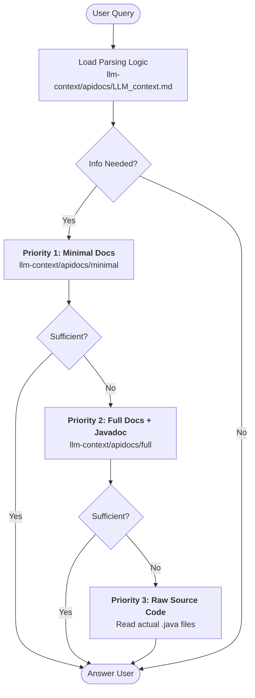

# Project Knowledge Base & Navigation

> **Note to Developer:** Append this content to your project's root-level AI instructions (e.g., `GEMINI.md`, `CLAUDE.md`, `.cursorrules`). Ensure the path `llm-context/apidocs/` matches your generation output.

## 🧠 Information Retrieval Strategy

To understand this codebase efficiently and prevent hallucination, you must follow this strict hierarchy of information sources.

**Step 0: Initialization**
Before answering queries about the code, read **`llm-context/apidocs/LLM_context.md`**. This file contains the mandatory algorithmic logic for parsing the project's Prolog-based documentation.

**Step 1: The Retrieval Loop**
Follow this decision tree to retrieve information with maximum token efficiency:

## ⚡ Core Protocol

1.  **Source of Truth:** The Prolog facts in `llm-context/apidocs/` represent the authoritative structure of the project.
2.  **Token Conservation:**
    * **Always** attempt to resolve queries using the **Minimal** Prolog facts first.
    * **Only** load the **Full** docs if you need natural language context (Javadoc) or deep intent analysis.
    * **Last Resort:** Do not read raw source code files unless the Prolog documentation is missing the specific implementation detail required (e.g., inside a method body).