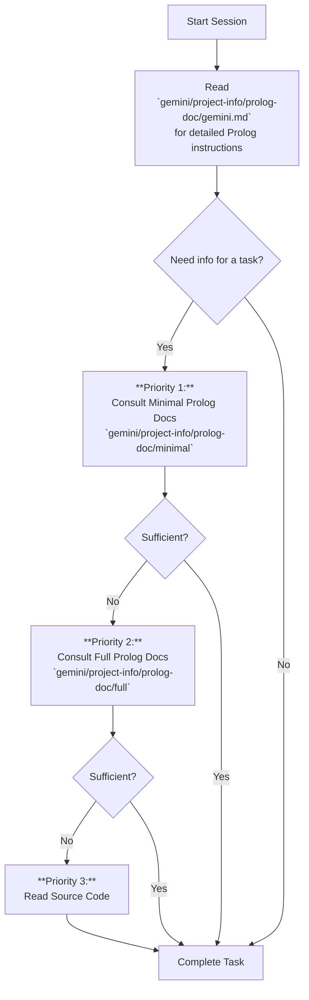

# AI Interaction Guide

---

## Project Overview

> **Note to Project Maintainers:** Please fill in the placeholders below with information specific to this project.

*   **Project Name:** `[PROJECT_NAME]`
*   **Goal:** `[PROJECT_GOAL]`
*   **Build Command:** `[BUILD_COMMAND]`
*   **Test Command:** `[TEST_COMMAND]`

---

## Information Retrieval Workflow

This document outlines the primary workflow for understanding and interacting with this codebase.

At the start of our session, and whenever you need to understand the structure or details of the code, please follow the workflow specified in this diagram.

### Key Principles:

1.  **Prolog First:** The Prolog documentation is the primary source of truth for understanding the codebase structure, types, methods, and their relationships. For detailed instructions on how to parse this data, consult the `gemini.md` file linked in the first step of the diagram.
2.  **Minimal Before Full:** Always start with the `minimal` version to get a fast, token-efficient overview. Only use the `full` version (with comments) if the structural information is not enough.
3.  **Code as Last Resort:** Only read the actual source files if the information cannot be found in either the minimal or full Prolog documentation.
